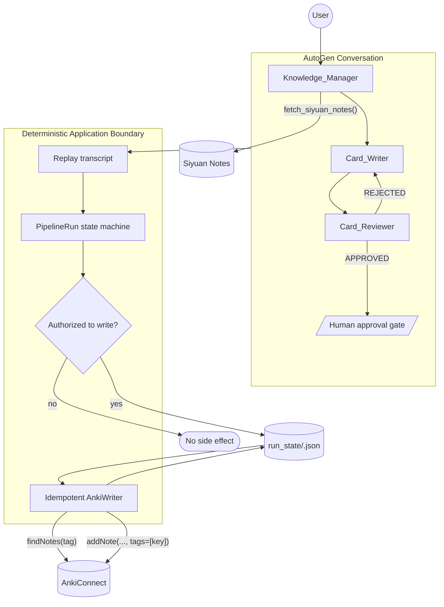

# Local Anki Agent

A local-first multi-agent pipeline that turns Siyuan notes into reviewed Anki flashcards using AutoGen and an Ollama/OpenAI-compatible model.

The key design rule is simple: **LLMs generate and review content; deterministic application code owns authorization, persistence, recovery, and Anki writes.**


## What This Project Demonstrates

- **Deterministic orchestration around LLM agents** instead of model-owned workflow control
- **Exact human authorization before side effects**
- **Capability separation**: agents may read source material, but no agent receives the Anki write capability
- **Durable workflow state** persisted as validated Pydantic JSON
- **Idempotent Anki writes** using application-owned tags and reconciliation
- **Crash/timeout recovery** with `--resume <RUN_ID>` without rerunning the LLM workflow
- **Typed integration failures and bounded retries** for operations that are safe to repeat
- **Offline automated tests and CI** with `uv`, Ruff, and pytest

## Architecture



The AutoGen conversation is treated as **untrusted input**. After it ends, application code rebuilds authoritative state by replaying validated cards and exact protocol decisions into `PipelineRun`.

## Workflow

```text
Siyuan
  ↓
Knowledge_Manager
  ↓
Card_Writer
  ↓
Card_Reviewer
  ├── REJECTED → Card_Writer
  └── APPROVED
        ↓
Human APPROVE / REJECT
        ↓
PipelineRun
        ↓
persist approved manifest
        ↓
idempotent AnkiWriter
        ↓
AnkiConnect
```

The reviewer → writer reflection loop is capped at two rejections before escalation to human review.

## Reliability Design

### Deterministic routing

Agent handoffs use application code rather than LLM-selected orchestration.

**Why:** routing becomes testable, auditable, and free of extra inference cost.

**Tradeoff:** less dynamic than model-selected routing, but better suited to a fixed study-card workflow.

### Human approval is an authorization boundary

Only the exact decision:

```text
APPROVE
```

authorizes a write.

Reviewer approval, malformed card JSON, `NOT APPROVED`, or prose such as `I approve these` cannot authorize Anki access.

The rule is enforced by `PipelineRun.can_write`, not by prompt instructions.

### Agents do not own Anki writes

The `Knowledge_Manager` may read Siyuan through `fetch_siyuan_notes()`.

No AutoGen agent receives `addNote`, `findNotes`, `write_approved_run`, or persistence capabilities.

```text
Agents
  ↓
validated transcript replay
  ↓
PipelineRun
  ↓
human-authorized state
  ↓
AnkiWriter
```

### Durable approved-run state

Before the first Anki side effect, the exact approved card set is persisted to:

```text
run_state/<run_id>.json
```

Each card has durable write metadata:

```text
index
idempotency_key
status = pending | written | failed
anki_note_id
failure
```

`RunStore` writes to a temporary file, flushes + `fsync`s it, then atomically replaces the destination with `os.replace()`.

Pydantic validates state again when it is loaded.

### Idempotent Anki writes

Each approved card receives a deterministic run-scoped tag:

```text
local_anki_agent_id_<digest>
```

The key is derived from:

```text
run_id + card index + approved front + approved back
```

Before writing:

```text
findNotes(idempotency tag)
        │
        ├── one note      → mark already written
        ├── no notes      → addNote(..., tags=[key])
        └── multiple      → fail safely
```

Progress is persisted after entering the write stage, after each confirmed card, and after terminal success/failure.

### Safe recovery after timeout or crash

An `addNote` timeout is ambiguous:

```text
Application ── addNote ──► Anki
                           │
                       note created
                           │
Application ◄── timeout ───X
```

Blindly retrying could create a duplicate.

Instead:

```bash
uv run python main.py --resume <RUN_ID>
```

Recovery:

1. loads the previously approved `PipelineRun`;
2. verifies that it is resumable;
3. skips Siyuan and AutoGen initialization;
4. preserves already-confirmed cards;
5. reconciles unresolved cards by idempotency tag;
6. creates only genuinely missing cards;
7. persists progress until completion.

Both persisted states are recoverable:

```text
WRITING + IN_PROGRESS
FAILED  + FAILED/PARTIAL
```

The first matters when the process disappears before application code can record a terminal failure.

### Typed failures and retry policy

External adapters distinguish:

```text
timeout / connection / temporary 5xx
    → transient integration failure

rejected / malformed response
    → permanent integration failure

malformed application payload
    → validation failure
```

`retry_call()` uses bounded exponential backoff for safe operations such as the read-only Siyuan prefetch.

Anki writes are not blindly retried; unresolved cards are reconciled against Anki first.

## State Model

```text
FETCHING
   ↓
GENERATING
   ↓
REVIEWING
   ├── rejected → GENERATING
   └── approved
          ↓
AWAITING_HUMAN
   ├── REJECT → GENERATING
   └── APPROVE
          ↓
WRITING
   ├── all confirmed → COMPLETED
   └── failure       → FAILED
                         │
                       --resume
                         │
                         └──► WRITING
```

Aggregate Anki write state is tracked separately:

```text
not_started
in_progress
partial
succeeded
failed
```

This preserves whether a failed run had already confirmed some cards.

## Observability

Each pipeline execution writes structured JSON events under `logs/`, including:

- agent messages;
- tool calls;
- reviewer rejections;
- human decisions;
- integration failures;
- final saved-card counts.

Agent message content copied from the AutoGen result is currently truncated to 500 characters in `main.py`, so these files are an operational trace rather than a lossless transcript archive.

## Quick Start

### Prerequisites

- Python 3.13+
- [`uv`](https://docs.astral.sh/uv/)
- Ollama or another OpenAI-compatible LLM server
- Siyuan Notes with its local API available
- Anki with AnkiConnect

### Install

```bash
git clone https://github.com/ronketer/local-anki-agent.git
cd local-anki-agent

uv sync --extra dev
```

`uv` creates/synchronizes the project `.venv` and installs `anki_pipeline` from the repository's `src/` layout.

### Configure

```bash
cp .env.example .env
```

PowerShell:

```powershell
Copy-Item .env.example .env
```

At minimum, set:

```env
TARGET_BLOCK_ID=
```

The remaining local defaults are documented in `.env.example`.

### Run

Start Siyuan, Anki + AnkiConnect, and the configured LLM server:

```bash
uv run python main.py
```

Override the configured Siyuan block:

```bash
uv run python main.py --block <BLOCK_ID>
```

Resume a persisted interrupted write:

```bash
uv run python main.py --resume <RUN_ID>
```

Resume does not regenerate or rereview cards.

## Testing

The reliability suite is designed to run without live Siyuan, Anki, Ollama, or cloud APIs:

```bash
uv run pytest
```

Coverage includes:

- exact reviewer/human decision parsing;
- workflow transitions and rejection escalation;
- transcript replay from untrusted agent output;
- malformed card output;
- deterministic routing/capability policy;
- zero Anki writes without authorization;
- typed integration failures and retry behavior;
- atomic run-state persistence;
- deterministic idempotency manifests;
- per-card write progress;
- already-present note reconciliation;
- partial write failures;
- duplicate idempotency-tag detection;
- interrupted-run recovery.

Lint:

```bash
uv run ruff check .
```

## Continuous Integration

GitHub Actions runs on pushes and pull requests:

```text
checkout
   ↓
setup uv
   ↓
install pinned Python
   ↓
uv sync --locked --extra dev
   ↓
ruff check .
   ↓
pytest
```

The workflow requires no Siyuan, Anki, Ollama, or API secrets because external integrations are isolated in the automated tests.

## Project Structure

```text
.
├── .github/
│   └── workflows/
│       └── ci.yml
├── main.py
├── pyproject.toml
├── uv.lock
├── .env.example
├── src/
│   └── anki_pipeline/
│       ├── agents.py
│       ├── anki_writer.py
│       ├── config.py
│       ├── errors.py
│       ├── logger.py
│       ├── models.py
│       ├── orchestrator.py
│       ├── retry.py
│       ├── routing.py
│       ├── run_store.py
│       ├── tools.py
│       └── workflow.py
├── tests/
├── logs/                    # runtime JSON traces
└── run_state/               # durable local run snapshots; gitignored
```

## Configuration

Representative defaults:

```env
TARGET_BLOCK_ID=

SIYUAN_API_TOKEN=
SIYUAN_API_URL=http://127.0.0.1:6806/api/block/getBlockKramdown

LLM_BASE_URL=http://127.0.0.1:11434/v1
LLM_MODEL_ID=qwen2.5-coder:3b
LLM_PROVIDER=ollama
LLM_API_KEY=placeholder

ANKI_CONNECT_URL=http://localhost:8765
ANKI_DECK_NAME=Default
```

The default setup is **local-first**, not local-only. If `LLM_BASE_URL` points to a cloud provider, source content sent to that provider leaves the local machine.

## Design Tradeoffs

### Deterministic state machine over agent-owned workflow control

The workflow has known stages and safety boundaries. Encoding them in Python keeps the LLM focused on drafting and reviewing cards rather than control flow.

### Atomic JSON state over a database

Recovery is for a local single-user process. Validated JSON snapshots are simpler to operate and inspect than introducing SQLite, Redis, or a workflow engine.

### Reconciliation over blind retries

After an ambiguous `addNote` timeout, querying Anki by an application-owned idempotency tag is safer than repeating the side effect immediately.

### Run-scoped idempotency over global deduplication

The key protects retries of the **same approved run**. It does not prevent the user from intentionally creating a similar card in a future run.

## Security Boundaries

- `.env` is gitignored; credentials come from environment variables.
- No LLM agent receives the Anki write capability.
- Exact human approval is required before writing.
- Persisted run state is Pydantic-validated before recovery.
- Path-like run IDs are rejected by `RunStore`.
- Ambiguous Anki writes are reconciled before recreation.
- Multiple notes sharing one idempotency tag fail safely instead of guessing.

## Technologies

- Python 3.13+
- Microsoft AutoGen AgentChat
- Pydantic v2
- Requests
- Ollama / OpenAI-compatible model APIs
- Siyuan Notes
- AnkiConnect
- uv
- pytest
- Ruff
- GitHub Actions

## License

MIT License — see [LICENSE](LICENSE).
